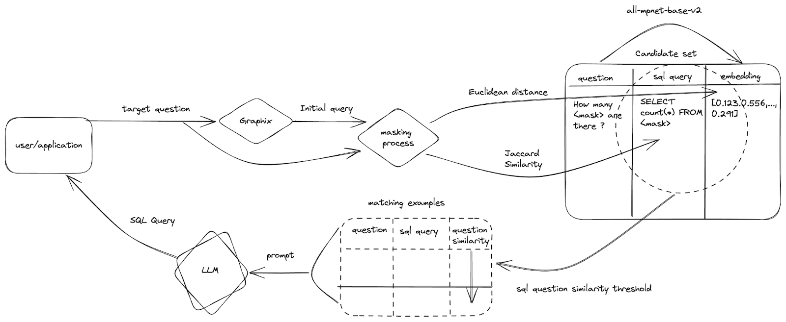

# Appendix

Following to be hosted separately e.g. Gist.

Summarizing[ DAIL-SQL paper](https://arxiv.org/abs/2308.15363), the simplified RAG flow:

1. A set of known questions and their accompanying SQL statements are masked. This uses an approach described in[ an earlier paper](https://github.com/microsoft/rat-sql), based on a 𝑛-gram matching-based schema-linking method. These masked questions have any values and column names replaced with `&lt;mask>` and `&lt;unk>` values.
2. The masked questions are then embedded with a pre-trained sentence Transformer, `all-mpnet-base-v2`. These can be stored in memory for matching or databases capable of performing distance matching. We call this our candidate set.
3. A skeleton SQL statement is generated for the target question using[ Graphix](https://arxiv.org/abs/2301.07507). This preliminary query is also masked, along with the target question.
4. Using the target question (also masked), similar masked questions from the candidate set are identified via a Euclidean distance calculation. Simultaneously, the query similarity between the preliminary SQL answer and the candidates is computed using Jaccard similarity. 
5. Finally, the selection criterion prioritizes the sorted candidates by question similarity with a query similarity greater than a predefined threshold. In this way, the selected top examples are similar to the target question with respect to the text and SQL.
6. The filtered set of SQL questions and their corresponding queries are provided as the context in the prompt to ChatGPT-4. 

The paper also proposes a specific prompt structure where the schemas are included as `CREATE TABLE` statements with the target question in quotes. This is principally to provide foreign key information to the LLM for joins. While not needed for our use case, our schema does have columns from which SQL answers could be inferred e.g. a `geo` column. Finally, the prompt includes some example questions and their SQL queries, again presenting the question in comment blocks i.e. /**/.
